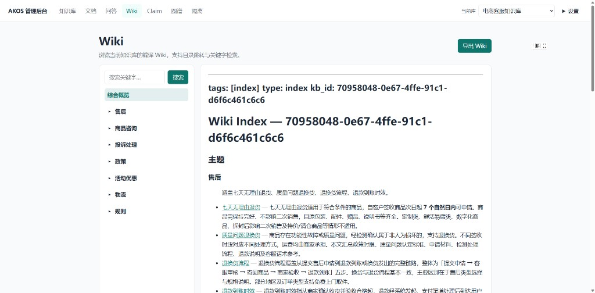
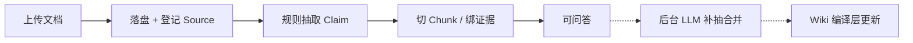
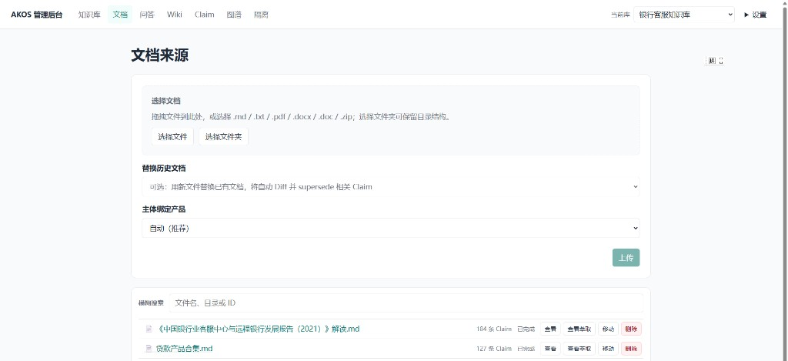
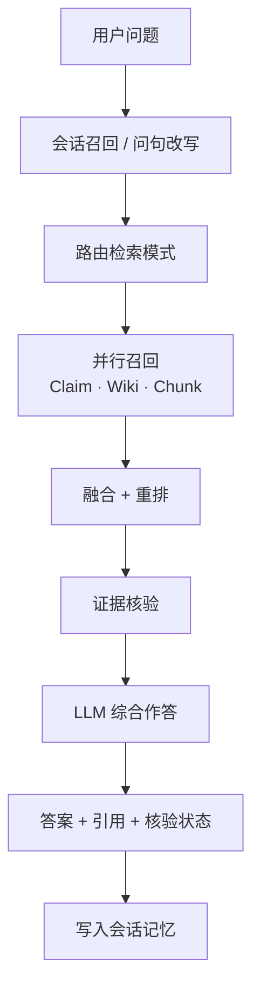
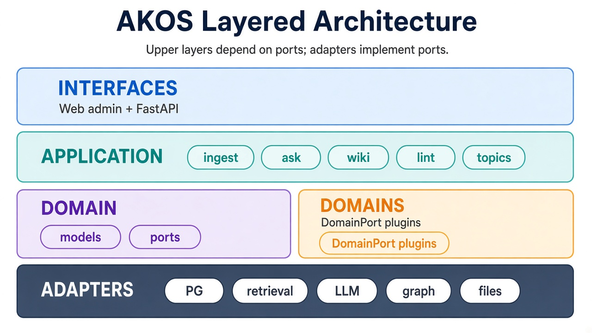

# AKOS — Agent-Native Knowledge Operating System

面向业务知识库的操作系统：文档入库 → 结构化 Claim → 可信问答 → Wiki 视图，支持多知识库隔离。

系列解析：[知识库管理系统（AKOS）](https://juejin.cn/column/7685907832282251310)（掘金专栏）

## 知识形态怎么配合

同一知识库里并存四类载体，问答时各司其职——这是相对「纯向量 RAG」的核心差异：

| 形态 | 是什么 | 主要用途 |
|------|--------|----------|
| **Claim** | 结构化三元组（主谓宾）+ 证据引用 | 精确事实、可核验；综合作答时优先进入上下文 |
| **Chunk** | 原文切片 + 向量 | 补全叙述细节、未抽全的段落 |
| **Wiki** | 由 Claim/主题编译的 Markdown 页 | 主题浏览与主题级检索 |
| **知识图谱** | 实体/关系（含主题簇等） | 关系型问题、主题导航 |

```text
文档 Source
   ├─→ Chunk（原文索引）
   ├─→ Claim（结构化事实 + 证据 span）
   │      └─→ Wiki 编译页（主题/实体聚合）
   └─→ Graph（实体边 / 主题簇）
              ↑
         Ask：三路并行召回 → 加权融合 → Claim 优先重排 → 核验 → 综合作答
```

Claim 是可审计的真相单元；Chunk 保真原文；Wiki 做人读与主题召回；图谱补关系。不是四选一，而是同一条知识链上的不同投影。



## 核心能力

| 能力 | 说明 |
|------|------|
| **入库** | 上传文档；规则同步抽取 + LLM 异步补抽；切片与证据绑定 |
| **问答** | Claim / Wiki / Chunk 三路检索 + 重排；答案带引用、核验状态与可选轨迹 |
| **Wiki** | 从 Claim 编译/导出 Markdown；Lint 检查冲突与缺证 |
| **管理台** | 知识库、文档、Claim、隔离审批、问答调试 |

## 核心流程

### 入库

同步先可检索；LLM 补抽与 Wiki 编译在后台完成。





### 问答



## 与常见方案对比

| 方案 | 优势 | 不足 | 相对 AKOS |
|------|------|------|-----------|
| **纯向量 RAG** | 落地快 | 易幻觉、难审计 | Chunk 兜底，Claim 核验约束答案 |
| **纯知识图谱** | 关系清晰 | 文本细节弱、成本高 | Graph 作增强，不替代 Claim/原文 |
| **文档库** | 简单存档 | 问答弱 | 可浏览，问答仍走三路检索 |
| **笔记 Wiki** | 人读友好 | 缺证据链与审批 | Wiki 是投影；权威在 Claim + 证据 |

更适合：**答案要可追责、多库隔离、事实陈述与原文段落都要用**。轻量闲聊用纯 RAG 即可。

## 架构



依赖方向：接口与用例依赖端口；适配器实现端口。组合根在 `akos.bootstrap`。

## 快速开始

Python 3.11+。依赖用 [uv](https://docs.astral.sh/uv/) 装进项目内 `.venv`（不要用系统 Python 或 conda 混装）。

```bash
uv sync --extra dev
cp .env.example .env   # 按需改 LLM / PG 等，详见文件内注释

# 后端
uv run uvicorn akos.interfaces.api.main:create_app --factory --reload --host 127.0.0.1 --port 8000

# 前端（另开终端）
cd web && npm install && npm run dev
```

文档解析、向量、Neo4j 按需加上对应 extra：`uv sync --extra dev --extra docs --extra embedding --extra neo4j`。

- 管理台：[http://127.0.0.1:5173](http://127.0.0.1:5173)
- API 文档：[http://127.0.0.1:8000/docs](http://127.0.0.1:8000/docs)
- 可选鉴权：`.env` / `web/.env.local` 中 `ADMIN_API_TOKEN` 与 `VITE_ADMIN_API_TOKEN` 一致

```bash
uv run pytest --ignore=web
```

生产栈见 `deploy/`。

## 代码结构

```text
akos/
  domain/          # models + ports
  application/     # ingest / ask / wiki / lint / topics
  adapters/        # PG、检索、LLM、图、文件…
  domains/         # 领域插件
  interfaces/api/  # FastAPI
  bootstrap.py
infra/             # settings、db、schema
web/               # 管理台
```
