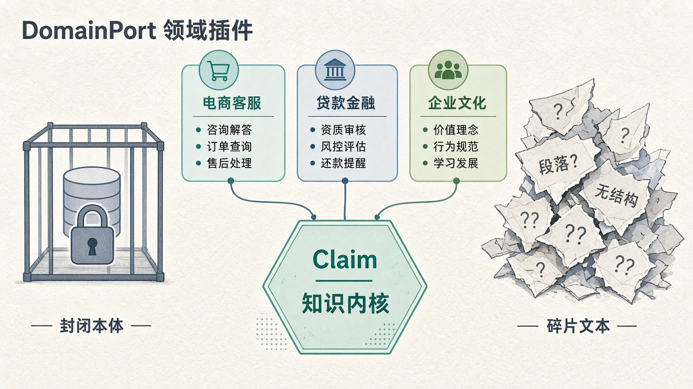
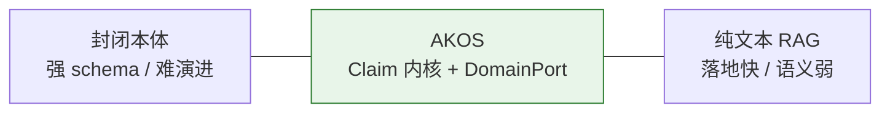
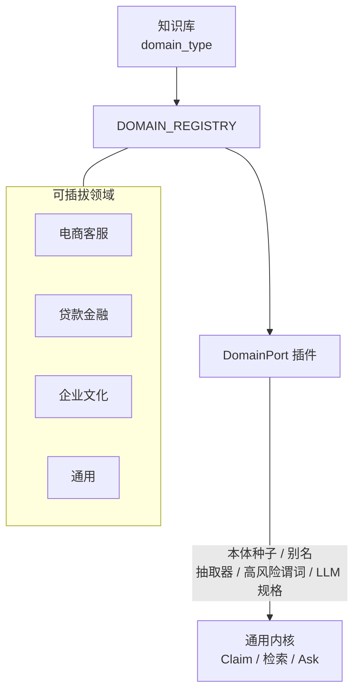
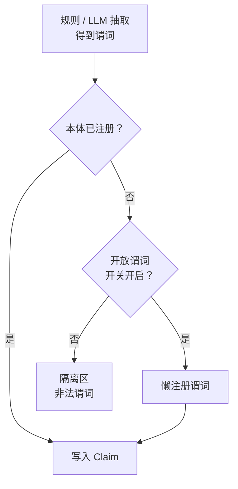

# 知识操作系统深析（一）：领域语义该「定死」还是「可演进」？

> 系列第 1 篇 · 重点：**DomainPort** 与 **开放谓词 vs 封闭本体**  
> 约读 10–12 分钟



*图：左侧刚性锁定 schema，右侧碎片化文本；中间各业务域经 DomainPort 挂入 Claim 内核。*

---

## 先讲一个真实痛点

假设你服务两家内部「知识客户」：电商客服要答「定制商品能不能七天无理由」，贷款运营要答「某产品提前还款是否收违约金」。两边都有 PDF、话术表、制度修订稿。

若你做一个**封闭本体**：先花几周定 OWL / 行业 schema，「退货时限」「运费承担方」「违约金规则」全部进类型系统。上线后业务突然加了「运费险是否赔付」「利率浮动区间」——谓词不在名单里，抽取进不了库，图谱推理也帮不上忙。改 schema 等于动底座：抽取 prompt、校验规则、前端展示、历史数据迁移一起抖。

若你上**纯向量 RAG**：两周能演示。问句一来，切块召回、大模型生成，看起来很聪明。但运营追问三件事时系统会哑火：

1. 权威结论到底是「支持」还是「不支持」？  
2. 依据落在原文哪一句？  
3. 客服口径和金融口径会不会串库？

瓶颈往往不是「向量模型够不够新」，而是：**领域语义能不能演进，而不推倒重来；同时又不能退化成不可治理的文本汤。**

AKOS（Agent-Native Knowledge Operating System）选第三条路：**通用 Claim 内核 + 可插拔 DomainPort + 可控的开放谓词**。



---

## 市场常见做法的盲区

| 路线 | 代表形态 | 强项 | 典型盲区 |
|------|----------|------|----------|
| 封闭本体 / 强 KG | OWL、行业标准、严格三元组 | 可校验、可推理、口径统一 | 业务一变就要改模型；建模周期长 |
| 纯文本 RAG | 切块 + 向量 + 生成 | 落地快、覆盖面大 | 无稳定事实身份；难审计、易串义 |
| 页面 Wiki | Notion / Obsidian / 内部 Wiki | 人可读、可协作 | 页面是叙事容器，不是可版本化事实 |
| 「图谱 + RAG」套壳 | 抽三元组再向量化 | 看起来两边都有 | 要么 schema 极严抽不动，要么乱抽不可信 |

封闭本体把「正确」前移到建模阶段，假设世界先被说清楚。真实企业知识却是**边运营边成形**：客服话术、贷款产品合集、企业文化手册，谓词集合半年就会膨胀。

自由文本 RAG 则把「正确」外包给生成模型：召回对了不一定答对，答对了也不知道依据是哪条制度、用的是哪个版本。

两者共同的盲区是：**缺少一个既承载领域差异、又不把领域锁死进内核的边界。**

---

## AKOS 怎么选：DomainPort

### 内核通用，差异外置

AKOS 的知识内核是通用的 **Claim**（主体、谓词、客体、类型、置信度、状态、时效、证据）。内核不关心「退货」还是「违约金」——那是领域语义。

领域差异被收敛进 `DomainPort`：注册本体种子、提供规则抽取器、别名归一、回答话术、高风险谓词清单、以及给 LLM 抽取用的规格。

```python
# domains/base.py（协议摘要）
class DomainPort(Protocol):
    name: str

    def register_ontology(self, ontology: OntologyPort) -> None: ...
    def get_extractor(self) -> ExtractorPort: ...
    def get_aliases(self) -> list[str]: ...
    def format_claim(self, claim: Claim) -> str: ...
    def high_risk_predicates(self) -> list[str]: ...
    def llm_extraction_spec(self) -> LlmExtractionSpec: ...
```

电商客服、贷款金融、企业文化、通用域，都以同一套接口挂进 `DOMAIN_REGISTRY`。创建知识库时选定 `domain_type`，换的是**语义插件**，不是换一套检索框架或问答编排。



### 一个电商域的直觉例子

在 `ecommerce_cs` 里，你可以预注册「运费承担方」「退货时限_天」等谓词；把「7天无理由 / 七天无理由退货」收成别名，让问句归一更稳；把涉及钱与时限的谓词标成**高风险**，入库路径上抽样做原文 span 校验。

贷款域换一套种子与话术即可——Ask 图、Claim 表、Wiki 编译层仍然是同一套。这与「做一个覆盖宇宙的超级本体」不同：

- **通用本体**：追求一次建模、处处复用，结果往往是又大又空、谁都不敢改。  
- **DomainPort**：每个业务线只携带自己真正在用的语义，新域以插件进入，旧域互不污染。

### 和「多租户」不是一回事

知识库隔离（`knowledge_base_id`）解决的是**数据边界**；DomainPort 解决的是**语义边界**。同一套系统可以有两个电商库（不同商家政策），也可以有一个贷款库——前者共享插件、隔离数据；后者换插件、换语义。

---

## 开放谓词：演进的阀门，不是放飞

仅有 DomainPort 仍可能僵化：若 LLM **只能**抽白名单谓词，未知关系一律进隔离区，领域演进仍然靠人改 seed 文件。运营会说：「你们不是智能抽取吗？为什么新说法永远进不来？」

AKOS 用开关表达取舍：`AKOS_EXTRACT_OPEN_PREDICATES`。

| 模式 | 陌生谓词怎么办 | 适合谁 |
|------|----------------|--------|
| 关闭（封闭） | 进 quarantine（`invalid_predicate`），人工评审后再入库 | 强合规、谓词必须先评审 |
| 开启（开放） | 证据合法时可**懒注册**进本体，再写 Claim | 业务语义快速膨胀、允许边跑边长 |



要点是：**开放的是「发现新关系」的通道，不是取消治理。**

- 开放谓词回答：**世界比 seed 大**。  
- 封闭校验 / 隔离区回答：**写入主库前要过关**。  
- 高风险谓词仍可抽样校验；质量问题仍可进 quarantine（本系列第三篇展开）。

对照市面「知识图谱知识库」：要么 schema 极严、业务改不动；要么三元组由模型随便抽，图谱三个月后不可信。AKOS 把两端拆成**领域插件 + 开放/封闭阀门**，让演进成为配置，而不是架构重构。

### 混合抽取：让「可演进」跑得动

语义层再漂亮，若每次上传都要等 LLM 十分钟，运营不会用。AKOS 采用**规则同步 + LLM 异步补抽**：规则阶段秒级产出可用 Claim；后台 enrich 再补开放谓词与长尾关系。领域插件同时影响两段——规则抽取器与 `llm_extraction_spec` 都来自同一个 DomainPort。

---

## 你会在什么时候「感觉到」DomainPort？

1. **建库**：选 `ecommerce_cs` 还是 `loan_finance`，决定种子谓词与默认话术。  
2. **提问**：用户说「7天无理由」，归一成领域标准说法再检索。  
3. **回答**：`format_claim` 把结构化事实说成人话，而不是吐出生硬三元组。  
4. **抽取**：开放谓词打开后，新产品说明里冒出的关系可以长进本体；关掉则先隔离。  
5. **风控**：高风险谓词触发更严的原文核对，而不是一视同仁「置信度 0.8 就过」。

---

## 代价与边界

- **没有零配置通吃**：每个严肃领域至少要有别名、谓词种子、高风险清单；`generic` 能起步，但深度运营仍要定制插件。  
- **开放谓词扩大表面积**：若不接隔离审批与 lint（第三篇），「可演进」会滑向「不可审计」。  
- **插件质量参差**：烂插件会污染该库语义；要用注册表与评审约束谁能上生产域。  
- **本篇不谈问答链路**：Claim 如何成为权威、检索后如何校验再合成，见下一篇。

---

## 本篇收束

企业知识库的胜负手，常常不在「又换了一家向量库」，而在：**你有没有一条清晰的领域语义边界——可插拔、可演进、可开关。**

DomainPort 是这条边界的接口；开放谓词是边界上的阀门；Claim 内核则保证换插件时，操作系统本身不用重写。

下一篇要回答另一个更刺耳的问题：**可检索，是否等于可信？**

---

**系列导航**：[下一篇 · Claim 权威与可信问答](./02-claim-authority-trusted-ask.md)
