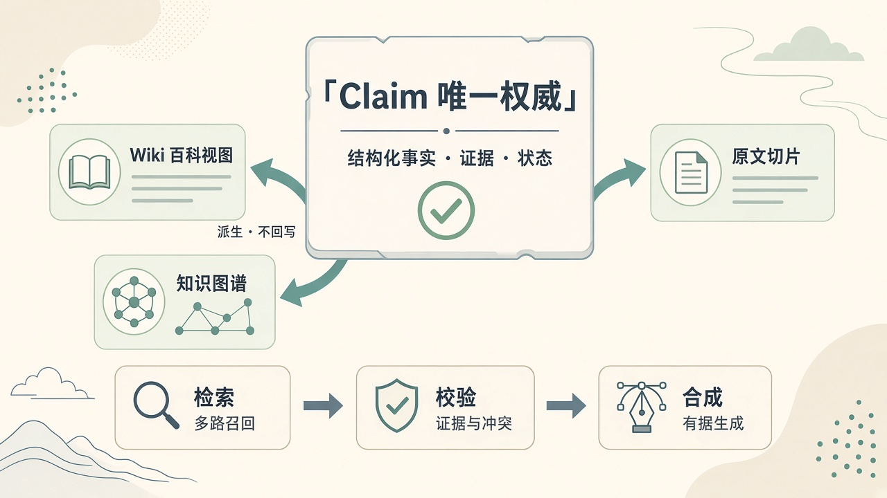
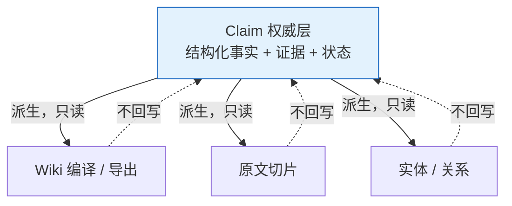
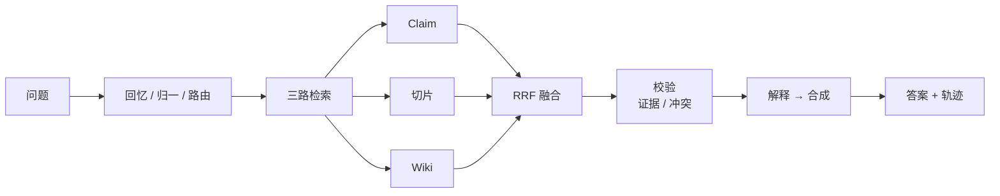
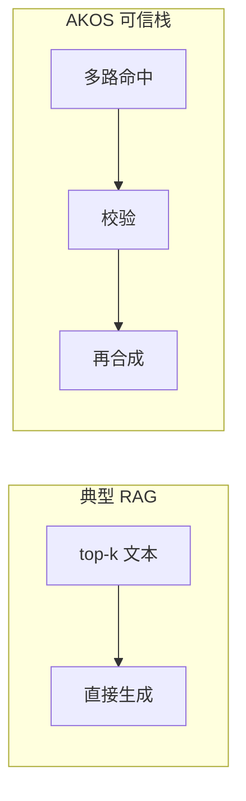

# 知识操作系统深析（二）：可检索 ≠ 可信

> 系列第 2 篇 · 重点：**Claim 为唯一权威** + **可信问答栈**  
> 约读 10–12 分钟  
> 上一篇：[领域语义该「定死」还是「可演进」？](./01-domainport-open-predicates.md)



*图：Claim 居中为唯一权威；Wiki / 原文切片 / 知识图谱是可检索的派生视图；下方为校验优先的问答栈。*

---

## 开篇：三个运营一定会问的问题

上一篇谈领域语义如何挂载。装上插件、文档也入库了之后，真正的压力测试通常是这三句：

1. **权威结论是什么？**（是 / 否 / 多少天 / 谁承担——不要一段含糊散文）  
2. **依据在原文哪一句？**（客服、风控、审计要可指认）  
3. **会不会两套现行说法同时成立？**（冲突要显式，而不是模型自己圆场）

市面许多「知识库问答」优化的是第四个指标：**答得像不像人、流不流畅。** 流畅很重要，但在制度与客服场景里，流畅可以掩盖不可信。

**能搜到相关段落，并不等于答案可信。**

---

## 市场默认闭环长什么样

### 典型 RAG

切块 → 向量 / 关键词召回 → top-k 塞进 prompt → LLM 生成。引用多为「某文档某段」。冲突时模型调和语气。运营很难把「事实对象」从「相似文本」里抠出来。

### 典型 Wiki

页面即真相。人可读、可协作，适合叙事与目录。但页面不是可版本化的事实单元；若再做「Query 回写 Wiki」，生成噪声会写回权威层——越用越脏。

### 典型知识图谱

三元组漂亮，推理演示好看。若缺原文锚点，监管与客服场景会问：这句话出自政策第几段？答不上，图谱就只是装饰。

| 形态 | 权威落在哪 | 证据 | 冲突 | 常见失败模式 |
|------|------------|------|------|--------------|
| RAG | 隐式在生成里 | 弱引用 | 模型圆场 | 流畅幻觉 |
| Wiki | 页面 | 编辑历史 | 靠人工 | 叙事≠事实 |
| 纯 KG | 边 | 常缺 span | 靠约束 | 不可指认原文 |
| AKOS | **Claim** | **evidence span** | **显式 conflict** | 抽取/治理成本 |

AKOS 的立场很硬：**PostgreSQL 中的 Claim 是唯一权威（source of truth）**；Wiki、Chunk、Graph 都是派生视图或检索层——可以检索、可以展示，**不回写权威库**。



这与「LLM Wiki」一类实践的关键分叉是：AKOS 可以借鉴 Lint 与 Wiki 视图层，但明确 **Query 不回写 Claim**。Wiki 是眼镜，不是大脑。

---

## Claim 到底是什么（不是「又一段摘要」）

一条 Claim 至少要能回答：谁（主体）、什么关系（谓词）、什么值（客体）、是否现行（状态）、凭哪句原文（证据）、属于哪一版事实身份（`family_id` / version）。

```python
# knowledge/models.py 概念字段
Claim(
    id="...",
    family_id="a1b2c3...",   # 事实族身份
    version=2,
    subject="定制商品",
    predicate="支持七天无理由退货",
    object="否",
    confidence=0.92,
    status="active",         # active / superseded / staging / quarantined
    valid_from=...,
    valid_to=...,
    source_ids=["src-..."],
)
```

状态机让「知识」从静态文本变成可运营对象：

- `active`：现行可答  
- `superseded`：被新版取代（历史可查，见第三篇）  
- `staging`：演化中的候选项  
- `quarantined`：未过闸门，不得当真相

没有这些，RAG 的「知识更新」往往只是**再灌一遍索引**；Wiki 的「知识更新」往往只是**又改了一页**。

---

## 多视图：看见的方式可以很多，真相只能有一个

| 视图 | 擅长 | 不擅长 |
|------|------|--------|
| Claim | 精确事实、可引用、可校验 | 长文阅读体验 |
| Chunk | 长文档定位、补召回 | 单独当权威易漂 |
| Wiki | 主题浏览、目录、人读 | 不当 SoT，不回写 |
| Graph | 关系探索、「A 和 B 什么关系」 | 缺证据时不可审计 |

Ask 时三路可以一起上：结构化优先，原文与 Wiki 补覆盖面。融合用加权 RRF（Claim 权重通常最高）。**检索命中 ≠ 采纳为答案依据**——中间必须过校验。

---

## 可信问答栈：先校验，再漂亮

市面默认是「召回后直接生成」。AKOS 把可信拆成可观察步骤（LangGraph 编排）：

1. **上下文与归一**：会话回忆、时间解析、`as_of`、领域别名与问句改写。  
2. **路由**：偏事实 / 偏关系 / 混合；流程类问题可走 Procedural Memory。  
3. **多路检索 + 融合 + 可选重排**：Claim / Chunk / Wiki；重排时 Claim 常保持前置。  
4. **校验 verify**：证据 span 能否对上原文；同族是否多条 `active`（冲突）。  
5. **解释 explain**：筛出可引用的有效 Claim。  
6. **合成 synthesize（可选）**：在依据约束下生成；citation 可核对。  
7. **作答与记忆**：合成失败可降级为 Claim 拼接或 Chunk 引用；写入会话记忆。



对照市面默认闭环：



### 产品上你该看见什么

- **trace**：每步花了多久、检索到了什么（可调试，而不是黑盒）  
- **evidence**：quote 与源文档可点开核对  
- **verification_status**：如 `verified` / `partial` / `unverified` / `conflict`  
- **competing_claim_ids**：冲突时把竞争事实摊开，而不是假装只有一个答案

KPI 从「答得流畅」扩展为：**依据是否可核对、冲突是否被显式标出、降级是否诚实。**

### 一个小场景

问：「定制商品能否七天无理由退货？」

- 检索命中相关政策切片与一条 Claim：`定制商品 -支持七天无理由退货-> 否`  
- verify：证据句在原文可定位 → `verified`  
- 合成：用领域话术说清楚，并带上可点的依据  

若同族还有另一条现行 Claim 说「是」，状态应是 **conflict**，把竞争项列出——这比「模型写一段和稀泥」对运营更有用。

---

## 和第一篇的衔接

DomainPort 决定「语义怎么说」；本篇决定「权威落在哪、答案怎么被证明」。没有 Claim SoT，开放谓词只是多了一些不可信三元组；没有校验栈，多路检索只是更贵的 top-k。

---

## 代价与边界

- **抽取与审批有成本**：没有完美抽取，就要隔离区与人工闸门（第三篇）。  
- **合成会失败**：必须能降级，不能为了演示永远输出华丽长文。  
- **多路检索更复杂**：用工程复杂度换可解释性，不是免费午餐。  
- **Wiki / Graph 仍要维护编译与同步**：它们是视图，视图脏了会影响召回，但不应被提升为真相源。

下一篇把镜头拉到时间轴上：**政策改版时，知识库究竟是「再灌一遍」，还是「可演化、可时点查询」？**

---

**系列导航**：[上一篇](./01-domainport-open-predicates.md) · [下一篇 · 演化与人机治理](./03-evolution-governance.md)
