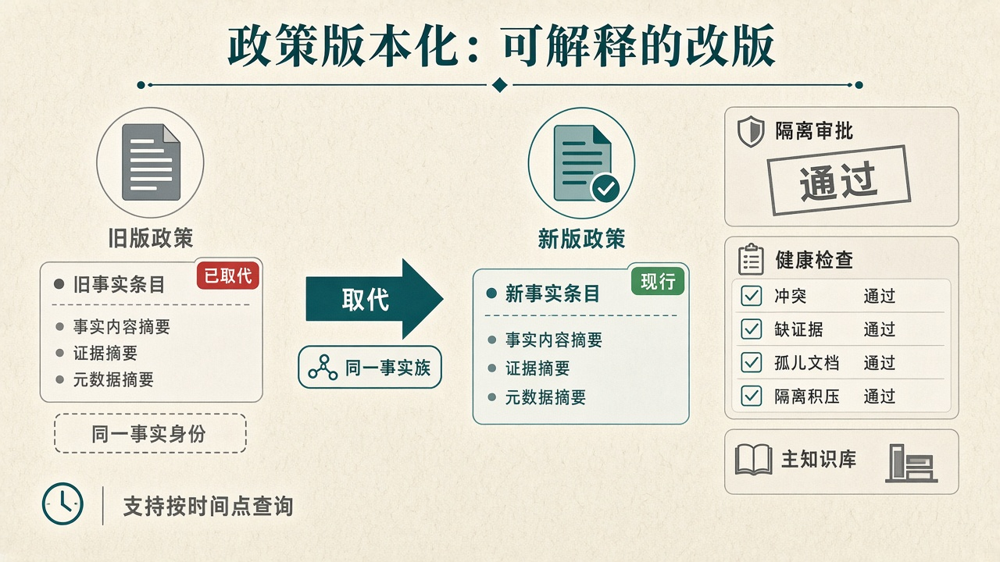
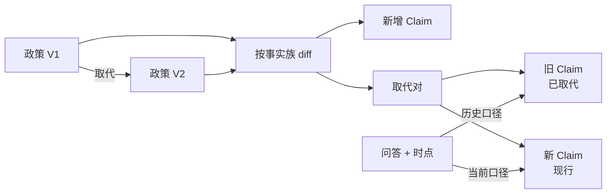
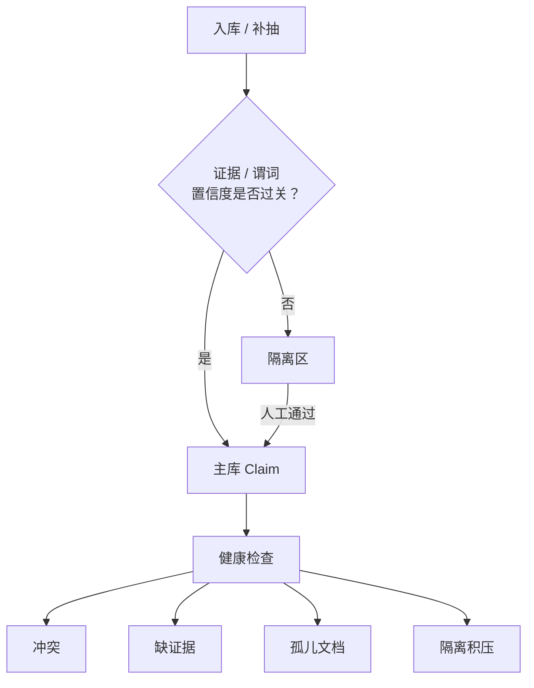

# 知识操作系统深析（三）：改版可解释，旧答可复现

> 系列第 3 篇 · 重点：**知识演化** + **人机治理**  
> 约读 10–12 分钟  
> 上一篇：[可检索 ≠ 可信](./02-claim-authority-trusted-ask.md)



*图：旧版政策事实「已取代」→ 新版「现行」；右侧隔离审批与健康检查后进入主知识库。*

---

## 改版是企业知识的常态，不是异常

制度、政策、产品说明有一个共同特征：**一定会改版。**

- 电商：运费承担方从「买家」改为「平台」  
- 贷款：某产品违约金规则按监管口径调整  
- 企业文化：行为规范换版，旧培训材料仍在库里  

市面知识库对此常见两种态度：

1. **覆盖式 RAG**：新文件进来，旧索引被替换或和旧块混在一起。演示永远「最新」。投诉回溯时，却很难证明「上个月客服按哪版答的」。  
2. **人工 Wiki**：改页面靠编辑纪律。链路长、易漏，且难与自动抽取流水线对齐——页面改了，结构化事实未必改；事实改了，页面可能还挂着旧表述。

AKOS 把**演化**当成一等公民，并把 LLM 抽取放进**可运营的人机闭环**。叠上前两篇的 DomainPort 与 Claim 可信栈，才配得上「知识操作系统」——而不是「又一个 RAG 套壳」。

---

## 市场盲区：文件有版本，事实没有身份

覆盖式重索引假设「最新即正确」。对企业客服与金融条款，现实需求通常是：

- **新旧并存一段时间**（灰度、渠道差异、过渡期）  
- **按时间点回答**（审计 / 客诉：「当时有效的是哪条」）  
- **改版可解释**（哪些事实被取代、哪些新增，而不是「整库重灌了」）

纯 Wiki 能留下编辑历史，但历史往往绑在**页面**上，不绑在**同一事实身份**上。一条退货规则改了措辞，系统未必知道它与旧结论是同一 `family`——于是你得到两段都像对的文本，以及一个会和稀泥的模型。

盲区可以概括成：把「文档文件」当版本单位，却没有把「事实」当版本单位。

| 维度 | 覆盖式 RAG | 人工 Wiki | AKOS |
|------|------------|-----------|------|
| 版本单位 | 文件 / 索引 | 页面修订 | **事实族 + 文档取代链** |
| 旧知识 | 易丢或混杂 | 在历史里 | `superseded` 可查 |
| 时点查询 | 基本没有 | 靠人工翻历史 | **`as_of`** |
| 改版报告 | 重索引日志 | diff 页面 | **claim 级 diff / 历史** |
| 错误进入主库 | 容易 | 靠编辑 | **quarantine + lint** |

---

## 事实族、取代链、时点查询

### 两层版本，而不是一层

- **文档层**：`replaces_source_id` 表达「这份政策替代那份」。  
- **事实层**：`family_id` + `version` + 状态机。新版本激活后，旧 Claim 标记为 `superseded`，而不是静默消失。

Ask 支持 **`as_of`**：站在某个时间点上看「当时有效」的知识。问句里的「去年」「当时」也可被解析进时间上下文（与第二篇的 `parse_time` 衔接）。

```python
# 同一业务事实，版本可取代
Claim(
    family_id="a1b2c3...",  # 事实族身份，跨版本稳定
    version=2,
    status="active",        # 旧版多为 superseded
    subject="运费承担方相关主体",
    predicate="运费承担方",
    object="平台",          # V1 可能是「买家」
    valid_from=...,
    valid_to=...,
)
# Ask(..., as_of=v1_生效日) → 仍应能复现旧口径
```

### 演化流水线在做什么

直觉上就三步：对新旧源做 **diff** → 识别新增与取代对 → **apply** 时激活新 Claim、退役旧 Claim，并留下可追溯事件。运营在管理台看到的是 Claim 家族历史，而不是一句「上传成功」。



### 小故事：运费承担方变更

1. V3 政策：运费由买家承担 → Claim A（`active`）。  
2. 上传 V4，并声明取代 V3。  
3. diff 发现同族客体从「买家」变为「平台」→ 生成取代对。  
4. apply 后：Claim A → `superseded`；Claim B → `active`。  
5. 今天问：答「平台」。  
6. `as_of=V3 生效日`：仍答「买家」，并带着旧证据链。  

没有事实族，你只是有了两份 PDF；有了事实族，你才有**可解释的改版**。

这与封闭本体「一次建模管永远」不同，也与 RAG「永远以最新 chunk 为准」不同：**身份稳定、表述可替换、时间可查询。**

---

## 人机治理：quarantine + lint

有演化没有治理，只是把错误版本化得更勤。开放谓词（第一篇）会让新关系长得更快——更需要闸门。

### 隔离区（quarantine）

AKOS 承认抽取不可全信。例如：

- 证据 span 与原文对不齐  
- 谓词不合法（且未开开放模式）  
- 置信度不足  
- 高风险谓词未通过抽样校验  

这些进入 **quarantine**，**人工审批**后再入主库。LLM 的位置是**加速发现**，不是**自动拥有真相写入权**。

混合抽取进一步把体验拆开：规则同步让库「秒级可问」；LLM 异步 enrich 的长尾与风险项，更多走隔离与合并策略，避免「要么全阻塞，要么全放行」。

### 健康检查（lint）

主库不是「进了就结束」。持续暴露运营指标，例如：

| 检查项 | 含义 | 为什么重要 |
|--------|------|------------|
| `conflict` | 同族多条 `active` | 直接破坏「权威唯一」 |
| `missing_evidence` | 现行 Claim 无证据 | 不可审计 |
| `orphan_source` | 文档未产出有效知识 | 入库空转 |
| `quarantine_backlog` | 隔离积压 | 治理跟不上抽取 |



对照市面：很多「智能知识库」把治理做成事后改 FAQ；AKOS 把闸门嵌进 ingest/enrich，把体检做成一等 API / CLI / 管理台能力。

### 和可信问答栈如何咬合

第二篇的 `verify` 会在问答期抓住「同族双 active」等冲突；本篇的 lint 则在运营期主动扫地。一边是**请求路径上的刹车**，一边是**车况仪表盘**——缺一不可。

---

## 代价与边界

- **状态空间变大**：`staging` / `active` / `superseded` / `quarantined` 需要产品文案与培训，不能只做底层枚举。  
- **`as_of` 依赖时间质量**：源文档时间戳不准，时点查询会「精确地错」。  
- **治理有人力成本**：开放谓词越猛，隔离与 lint 越忙——这是把幻觉成本显式化，好过藏在流畅回答里。  
- **演化 diff 不是魔法**：跨大改版、重写式政策，自动对齐事实族仍需人工确认边界。

---

## 三篇合读：什么叫「知识操作系统」


| 篇 | 核心问题 | 一句话答案 |
|----|----------|------------|
| 一 | 领域语义定死还是可演进？ | 插件化 DomainPort + 开放/封闭阀门 |
| 二 | 搜得到是否等于可信？ | Claim 为 SoT；先校验再合成 |
| 三 | 改版如何不丢历史、不放飞错误？ | 事实族演化 + 隔离 + lint |

合在一起，AKOS 想做的不是「更好的搜索框」，而是**让企业知识像操作系统里的对象一样**：

- 有**身份**（事实族 / Claim）  
- 有**权限边界**（库隔离、隔离区、审批）  
- 有**版本**（取代链、`as_of`）  
- 有**可观测性**（trace、evidence、lint）

向量检索、知识图谱、Wiki，都是这个对象系统上的**驱动程序**——重要，但不是内核。内核是：**可治理的结构化事实，如何在时间中被正确地相信。**

---

**系列导航**：[第 1 篇 · DomainPort](./01-domainport-open-predicates.md) · [第 2 篇 · 可信问答](./02-claim-authority-trusted-ask.md)
